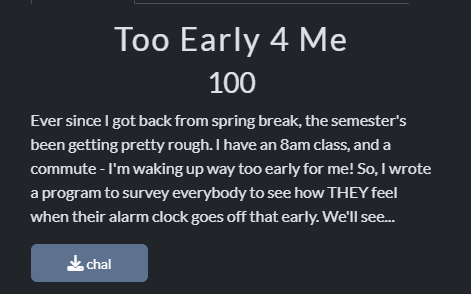
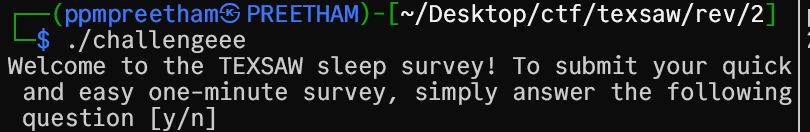
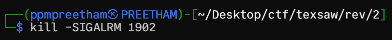

## Too Early 5 Me



We have a [chal](chal) file
I ran it.



running ghidra, we get:


Ten lines down, the truth:

```c
signal(0xe,sigalrm_handler);
```

and `sigalrm_handler` is calling `decode_flag`:


`decode_flag` looks like:


The function used a substitution box. No mystery there. It built a reverse lookup table:

```c
  local_10 = *(long *)(in_FS_OFFSET + 0x28);
  for (local_120 = 0; local_120 < 0x100; local_120 = local_120 + 1) {
      abStack_118[(int)(uint)(byte)sbox[local_120]] = (byte)local_120;
  }
```
The answer was clear. Send the SIGALRM signal while the program runs. Find the process, then kill it the right way.

in the main function, we have:
`signal(0xe,sigalrm_handler)` where we need to signal 14/SIGALRM.

Getting all the processes:
```bash
ps aux | grep challengeee
```


Number 1902, I took aim

killing the process:
```bash
kill -SIGALRM 1902
```


right after deleting the process, the flag appeared, clean and honest:


The flag is `texsaw{how_signalicious_much_swag}`